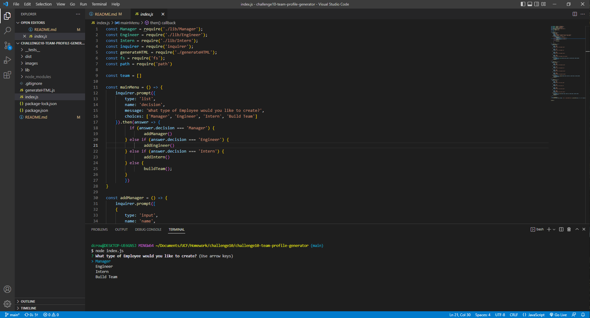

# TEAM PROFILE GENERATOR

This is a node application to generate an employee team profile page!

[Video of app execution](https://drive.google.com/file/d/13eQEEDQah0_HmDrRH19wV-h-4XIpKU_x/view)

## Description

This is our second node.js project. It allows the user to install necessary dependencies and generate
a an HTML template page based on user input after a series of prompts. It also consists of testing of  
each class.

### Installing

To install dependencies, simply run the command 'npm i'.

### Executing program

To execute the program run the command, 'npm start'.

### Testing

For testing, run the command 'npm test'.

## Authors

Dylan Crowley:

[Github](https://github.com/dcrowdev)  
[Twitter](https://twitter.com/dcrowdev)  
[LinkedIn](https://www.linkedin.com/in/dylan-crowley-3974b8252/)  
dcrowdev1025@gmail.com

## License

This project is licensed under the MIT license.

## Acknowledgments

UCF Fullstack bootcamp!
